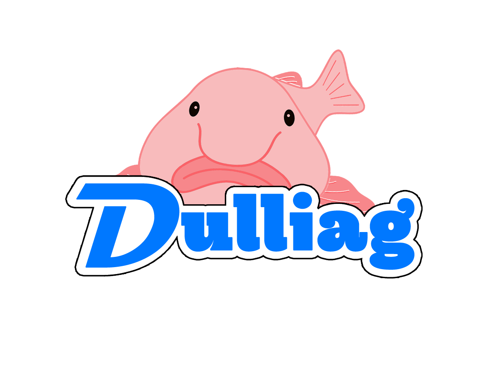

<p align="center">
  
  <h1 align="center">DulliBot</h1>
</p>

## :rocket: Features

<details>
  <summary>🔧 Configuration</summary>
  Specify roles-by-reaction, bot-activity... using an `config.json`
</details>

<details>
  <summary>👋 Welcome message</summary>
  Welcome every user by sending an welcome-message and giving them a specific role
</details>

<details>
  <summary>👽 Roles-by-Reaction</summary>
  Grant your users access to permissions by reaction on a message
</details>

<details>
  <summary>📰 Auto-Publishing</summary>
  Automaticly publish messages in specific categories. (Only works for news-channels)
</details>

<details>
  <summary>📊 Server-Stats</summary>
  Don't loose track about the amount of users and bots on your Discord Server
</details>

<details>
  <summary>📝 Logging</summary>
  Log your user action in an external MariaDB oder PostgreSQL Database
</details>

<details>
  <summary>🔔 ReallifeRPG Mod Update Notifications</summary>
  Keep your users about <a href="//realliferpg.de">ReallifeRPG Mod Updates</a> up to date
</details>

## :wrench: Installation

1. Clone the Repository

   ```shell
   git clone https://github.com/DulliAG/Discord-Bot.git
   ```

2. Create an `.env`-file for your credentials

   ```
   PRODUCTION=true
   TOKEN=<Discord Bot Token>
   DB_HOST=<Database Host>
   DB_USER=<Database Username>
   DB_PASSWORD=<Database Password>
   DB_DATABASE=<Database>
   ```

3. Create an `config.json` for your bot

   ```json
   {
     "bot": {
       "activity": "BOT_ACTIVITY"
     },
     "commands": { "prefix": "!db", "blacklist": ["!commands-which-are-used-by-other-bots"] },
     "roles": {
       "rlrpg": "DISCORD_ROLE_ID",
       "guest": "DISCORD_ROLE_ID",
       "sponsor": "DISCORD_ROLE_ID",
       "coding": "DISCORD_ROLE_ID",
       "developer": "DISCORD_ROLE_ID",
       "admin": "DISCORD_ROLE_ID",
       "owner": "DISCORD_ROLE_ID",
       "gruender": "DISCORD_ROLE_ID"
     },
     "roles_by_reaction": {
       "enabled": true,
       "reactions": [{ "id": "ROLE_ID", "name": "ROLE_NAME", "emoji": "EMOJI_NAME" }]
     },
     "arma": { "enabled": true, "current_version": "LATEST_REALLIFERPG_MOD_VERSION" },
     "channels": {
       "welcome": "WELCOME_CHANNEL_ID",
       "roles": "812142530413068298",
       "logs": "LOGS_CHANNEL_ID",
       "arma": "REALLIFERPG_CHANNEL_ID",
       "stats": { "member": "MEMBER_STATS_CHANNEL_ID", "bots": "BOTS_STATS_CHANNEL_ID" }
     },
     "auto_publish": { "enabled": true, "categories": ["CATEGORY_ID"] }
   }
   ```

4. Install the required dependencies

   ```shell
   npm i
   ```

5. Start the server
   ```shell
   npm start
   ```

## :link: Used Ressources

[DiscordJS](https://discord.com/developers/docs/intro)
[Supabase](https://supabase.io)
[Cron](https://www.npmjs.com/package/cron)
[@dulliag/logger.js](https://www.npmjs.com/package/@dulliag/logger.js)
